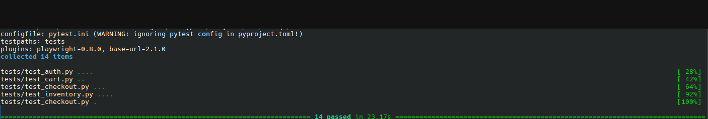
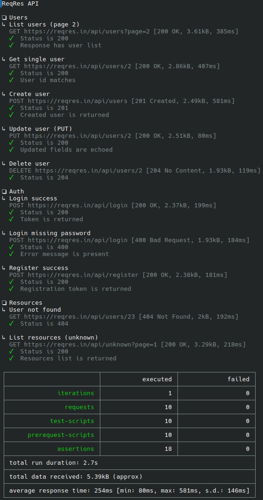
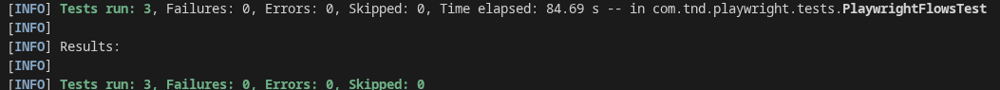
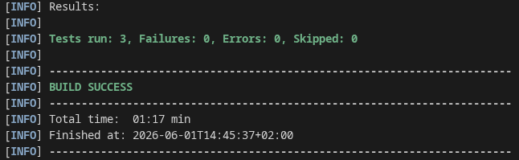

# TND QA Portfolio


This repository is a **learning + showcase project** for test automation roles.
I treat tests as puzzle design: each suite defines constraints the product must satisfy, and passing runs are evidence that behavior matches intent.

## Automation Story

I approach quality as a set of solvable puzzles:
- **Auth puzzle**: valid users pass, invalid users fail clearly.
- **State puzzle**: cart and checkout preserve/transition data correctly.
- **API puzzle**: requests return expected status codes, shapes, and business fields.

This portfolio shows that same mindset across Python and Java stacks, plus API automation with Newman.

## What This Proves

- **Architecture**: Page Object Pattern for maintainable UI tests.
- **Reliability**: smoke + regression split with deterministic assertions.
- **Environment management**: local `.env` files and GitHub Actions secrets.
- **Delivery discipline**: local runs and CI runs both treated as first-class signals.

| Suite | Tool | Target | Folder | What it proves |
|-------|------|--------|--------|----------------|
| **UI (Playwright)** | Playwright + pytest + POM | [SauceDemo](https://www.saucedemo.com) | [`ui/`](ui/) | Modern E2E design with readable page objects and stable waits |
| **UI (Selenium)** | Selenium 4 + pytest + POM | [SauceDemo](https://www.saucedemo.com) | [`selenium/`](selenium/) | Legacy-compatible E2E coverage with explicit synchronization |
| **UI (Java Playwright)** | Playwright Java + JUnit 5 + Maven | [SauceDemo](https://www.saucedemo.com) | [`java/playwright/`](java/playwright/) | Language portability: same quality story implemented in Java |
| **UI (Java Selenium)** | Selenium + JUnit 5 + Maven | [SauceDemo](https://www.saucedemo.com) | [`java/selenium/`](java/selenium/) | Architecture transfer: POM and flow modeling are stack-agnostic |
| **API** | Postman + Newman | [ReqRes](https://reqres.in) | [`api/postman/`](api/postman/) | HTTP assertions, auth handling, and CLI/API CI integration |

## Language Strategy

- Language matters, but **test design matters more**.
- My core selling point is fast adaptation: I can learn new syntax quickly and keep quality strategy intact.
- I use Page Object Pattern and flow-based thinking as portable architecture across tools.
- Cross-industry experience helps me prioritize high-impact risks first and focus automation where failures hurt most.

## Proof of Working Suites

Sanitized run screenshots (local path information intentionally hidden):

### Playwright suite



### Selenium suite


### Postman/Newman API suite



### Java Playwright suite



### Java Selenium suite



## 30-Second Run (Recruiter Quick Check)

### Playwright smoke
```bash
cd ui && python -m venv .venv && source .venv/bin/activate && pip install -e . && playwright install chromium && cp .env.example .env && pytest -m smoke
```

### Selenium smoke
```bash
cd selenium && python -m venv .venv && source .venv/bin/activate && pip install -e . && cp .env.example .env && pytest -m smoke
```

### Postman/Newman API
```bash
cd api/postman && npm install && REQRES_API_KEY=your_key npm test
```

### Java Playwright minimal suite
```bash
# requires: JDK 17+ and Maven
cd java/playwright && cp .env.example .env && mvn test
```

### Java Selenium minimal suite
```bash
# requires: JDK 17+ and Maven
cd java/selenium && cp .env.example .env && mvn test
```

Detailed setup:
- [ui/README.md](ui/README.md)
- [selenium/README.md](selenium/README.md)
- [java/README.md](java/README.md)
- [api/postman/README.md](api/postman/README.md)

## Run with Docker

Docker support is available for all suites via `docker-compose.yml`.

```bash
cp docker/.env.example docker/.env
```

Update `docker/.env` with your real values (especially `REQRES_API_KEY`), then run:

```bash
# build all suite images
docker compose build

# run one suite
docker compose run --rm ui_playwright
docker compose run --rm ui_selenium
docker compose run --rm java_playwright
docker compose run --rm java_selenium
docker compose run --rm api_newman
```

Optional full run:

```bash
docker compose run --rm ui_playwright \
  && docker compose run --rm ui_selenium \
  && docker compose run --rm java_playwright \
  && docker compose run --rm java_selenium \
  && docker compose run --rm api_newman
```

## CI (GitHub Actions)

Workflow: [`.github/workflows/ci.yml`](.github/workflows/ci.yml)

Runs on push/PR to `main` and manual dispatch:
- Playwright UI suite (`ui/`)
- Selenium UI suite (`selenium/`)
- Java Playwright UI suite (`java/playwright/`)
- Java Selenium UI suite (`java/selenium/`)
- Newman API suite (`api/postman/`)

Required GitHub secret:
- `REQRES_API_KEY` (ReqRes `x-api-key` for API tests)

Optional but supported:
- `STANDARD_USER`
- `STANDARD_PASSWORD`
- `LOCKED_OUT_USER`
- `LOCKED_OUT_PASSWORD`

CI uploads:
- Playwright run artifacts (`test-results` and report folder when present)
- Java Playwright surefire reports
- Java Selenium surefire reports
- Newman report artifacts (`junit`, `json`)

## Test Strategy

See [TESTING.md](TESTING.md) for:
- smoke vs regression intent
- scope choices and trade-offs
- out-of-scope items kept for future iterations

## Interview Talking Points

- **Playwright vs Selenium**: auto-waiting vs explicit waits, debugging ergonomics, and reliability trade-offs
- **POM structure**: why selectors/actions stay in page objects while assertions stay in tests
- **API auth adaptation**: updated ReqRes coverage after `x-api-key` requirement changes
- **Environment management**: local `.env` + GitHub Secrets in CI (no credentials committed to git)
- **Engineering mindset**: this repo is intentionally built as both a learning track and a production-style showcase
- **Portability over syntax**: Java and Python suites share the same POM patterns and risk-driven flow priorities
- **Risk-first perspective**: industry experience helps identify where automation gives the highest quality return

## Why This Matters for Hiring

- I can build tests, not just execute them.
- I can explain trade-offs (Playwright vs Selenium, UI vs API scope).
- I can operate with CI + secrets hygiene without leaking credentials.
- I can communicate quality as system behavior, not just pass/fail output.

## License

This project is licensed under the [MIT License](LICENSE).

Feel free to use, fork, and adapt this repository for learning purposes or as a base for your own automation practice.

If you have feedback, suggestions, or spot something I can improve, I would be happy to hear it.

SauceDemo and ReqRes are third-party demo services.
