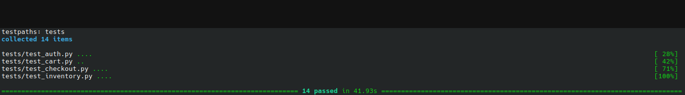

# UI — Selenium (SauceDemo)

Same SauceDemo coverage as the [Playwright suite](../ui/), implemented with **Selenium 4** (Python), **pytest**, and the **Page Object Model**. Uses Selenium Manager to resolve ChromeDriver automatically — no manual driver downloads.

This suite mirrors the same quality puzzles in a Selenium-first style:
- auth boundaries
- cart state transitions
- checkout success/error paths

## Latest green run (proof)



This gives legacy-stack confidence: the same behavior contract is validated outside Playwright as well.

## Prerequisites

- Python 3.10+
- Google Chrome installed

## Setup

```bash
cd selenium
python -m venv .venv
source .venv/bin/activate   # Windows: .venv\Scripts\activate
pip install -e .
cp .env.example .env
```

## Run tests

```bash
pytest                                 # headless Chromium (default)
SELENIUM_BROWSER=firefox pytest        # Firefox
pytest -m smoke           # critical path only
pytest -m regression      # broader coverage
HEADED=1 pytest           # visible browser window
```

## Run with Docker

From repo root:

```bash
cp docker/.env.example docker/.env
docker compose build ui_selenium
docker compose run --rm -e SELENIUM_BROWSER=chromium ui_selenium
docker compose run --rm -e SELENIUM_BROWSER=firefox ui_selenium
```

## Layout

| Path | Purpose |
|------|---------|
| `pages/` | Page objects — locators and actions |
| `tests/` | pytest tests (mirrors `ui/tests/`) |
| `config.py` | Settings from `.env` |

## Test scope

Same 14 scenarios as Playwright:

| File | Coverage |
|------|----------|
| `test_auth.py` | Valid login, invalid credentials, locked-out user, logout |
| `test_inventory.py` | Add/remove items, cart badge counts |
| `test_cart.py` | Cart contents, remove on cart page, continue shopping |
| `test_checkout.py` | Full purchase flow, validation errors, cancel |

## Playwright vs Selenium (this repo)

| | Playwright (`ui/`) | Selenium (`selenium/`) |
|--|-------------------|------------------------|
| Waits | Built-in auto-wait | Explicit `WebDriverWait` |
| Driver | `playwright install chromium` | Selenium Manager + local Chrome |
| Assertions | `expect(locator)` | Standard `assert` + `EC` |

Both suites share `.env` variable names and page object structure for easy comparison.
